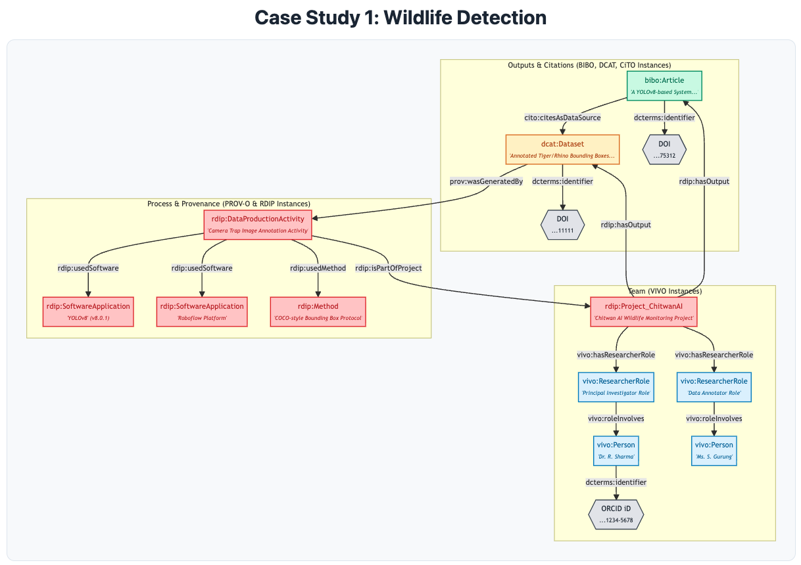
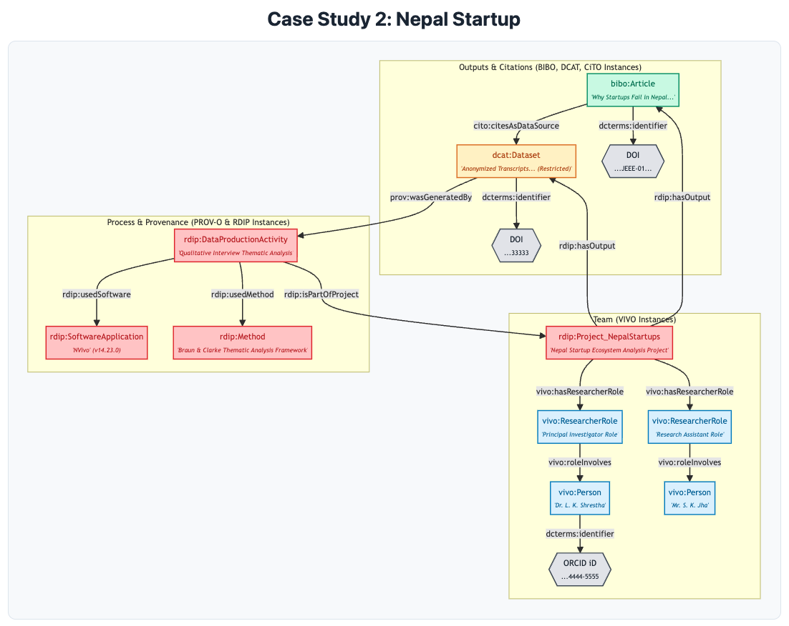

# RDIP Ontology Case Studies

### Case Study 1: Computer Science (Deep Learning for Animal Detection)
- Title: Automated Wildlife Monitoring in Chitwan National Park using YOLOv8 Fictional Publication: Sharma, R., & Gurung, S. (2024). A YOLOv8-based System for Real-time Tiger and Rhino Detection from Camera Traps. IEEE Transactions on Pattern Analysis and Machine Intelligence, 46(11), 1234-1245. https://doi.org/.../...

1. Modeling the Project and Team
   - The Project: The initiative is modeled as the central hub, an instance of `rdip:ResearchProject`. 
     - Instance: `rdip:Project_ChitwanAI`
     - Property: `dcterms:identifier` -> "https://raid.org/10.9876/raid.2023.011"

     - We use `rdip:ResearchProject` as the central class, as it's our core contribution for aggregating all aspects of a research initiative. We use dcterms:identifier to hold the RAiD, a persistent identifier (PID) for the project itself, directly addressing the advisor's feedback and ensuring the project is Findable (FAIR 'F').
   
   - The Team: The project team is modeled using the expressive VIVO role-based pattern to show how each person contributed.
     - Principal Investigator:
       - An instance of `vivo:ResearcherRole` is created: "Principal Investigator Role"
       - The project `rdip:Project_ChitwanAI` is linked via `vivo:hasResearcherRole` to this "Principal Investigator Role" instance.
       - This role, in turn, is linked via `vivo:roleInvolves` to an instance of `vivo:Person`: Dr. R. Sharma.
       - Dr. Sharma is identified by her `dcterms:identifier` -> ORCID iD: "https://orcid.org/0000-0002-1234-5678".
     - Data Annotator:
       - Another `vivo:ResearcherRole` instance is created: "Data Annotator Role".
       - This role is linked to `vivo:Person`: Ms. S. Gurung.
     - Instead of a generic `dcterms:contributor`, the VIVO pattern (`hasResearcherRole`/`roleInvolves`) allows us to be far more specific, as requested by the advisors. We can now query for "who was the Principal Investigator?" vs. "who was the Data Annotator?" This provides rich, queryable context and proper attribution. The ORCID iD ensures each person is uniquely identified and disambiguated (FAIR 'F').

2. Modeling the Data Production and Provenance
   - The Activity: The core process is an instance of our specialized class, `rdip:DataProductionActivity`.
     - Instance: `rdip:CameraTrapImageAnnotationActivity`
     - This directly addresses the advisor's feedback that `prov:Activity` was too broad. By creating a subclass `rdip:DataProductionActivity`, we specify that we are modeling the exact process that created the data (in this case, annotating images), not other project activities like writing the paper.
   - Link to Project: This activity is explicitly linked to the project hub.
     - Triple: `rdip:CameraTrapImageAnnotationActivity` `rdip:isPartOfProject` `rdip:Project_ChitwanAI`
     - This is the critical missing link. It creates a complete, unbroken chain of provenance. We can now trace a dataset to the activity that made it, and that activity back to the project it belongs to.
   - The Software Used: The activity used a deep learning model and an annotation platform, modeled as instances of `rdip:SoftwareApplication`.
     - Instance 1: `rdip:SoftwareApplication` -> "YOLOv8 Object Detection Model"
       - Property: `rdip:hasVersion` -> "8.0.1"
       - Property: `rdip:hasRepository` -> "https://github.com/ultralytics/ultralytics"
     - Instance 2: `rdip:SoftwareApplication` -> "Roboflow Annotation Platform"
     - Link to Activity: `rdip:CameraTrapImageAnnotationActivity` `rdip:usedSoftware` "YOLOv8..."
     - We model software as a class, not a text string, so we can attach crucial metadata like hasVersion and hasRepository. This is the cornerstone of Reproducibility (FAIR 'R'). Another researcher must know the version to replicate the experiment.
   - The Method Used: The annotation process followed a formal protocol, modeled as an instance of `rdip:Method`.
     - Instance: `rdip:Method` -> "COCO-style Bounding Box Annotation Protocol"
     - Link to Activity: `rdip:CameraTrapImageAnnotationActivity` `rdip:usedMethod` "COCO-style..."
     - This captures the how (the protocol) which is distinct from the what (the software). It makes the experimental design itself a formal, citable entity.

3. Modeling the Outputs and their Connection
   - The Dataset: The primary dataset is modeled as an instance of dcat:Dataset.
     - Instance: "Chitwan National Park Camera Trap Bounding Boxes (Tigers, Rhinos)"
     - Property: `dcterms:identifier` -> DOI: "https://doi.org/10.5678/zenodo.11111"
     - We use `dcat:Dataset` as it is the W3C standard for data catalogs. The DOI makes the dataset persistently Findable and Accessible (FAIR 'F', 'A').
   - Provenance Link: The dataset is linked to the activity that created it.
     - Triple: "Chitwan National Park..." `prov:wasGeneratedBy` `rdip:CameraTrapImageAnnotationActivity`
     - This `prov:wasGeneratedBy` link is the standard way to connect an output (the dataset) to the process (the activity) that created it, completing the provenance trace for Reusability (FAIR 'R').
   - The Publication: The resulting paper is an instance of `bibo:Article`.
     - Instance: "A YOLOv8-based System for Real-time Tiger Detection..."
     - Property: `dcterms:identifier` -> DOI: "https://doi.org/.../..."
     - `bibo:Article` is the standard class for a scholarly publication.
   - The Critical Data Citation Link: We use the CiTO standard to show the relationship.
     - Triple: `bibo:Article` `cito:citesAsDataSource` `dcat:Dataset`
   - As per our v1 refinement, we use the standard `cito:citesAsDataSource` property instead of a custom one. This is semantically precise (the paper uses the data) and ensures Interoperability (FAIR 'I') with other bibliographic systems.

  
### Case Study 2: Business (Why Startups Fail in Nepal)
- Case Study Title: Factors of Startup Failure in Nepal: A Qualitative Study of Tech Startups (2020-2023) Fictional Publication: Shrestha, L. K., & Jha, S. K. (2024). Why Startups Fail in Nepal: A Thematic Analysis of Founder Interviews. Journal of Entrepreneurship in Emerging Economies, 16(3), 201-218. https://doi.org/..../....

1. Modeling the Project and Team
   - The Project: The initiative is modeled as the central hub, an instance of `rdip:ResearchProject`.
     - Instance: `rdip:Project_NepalStartups`
     - Property: `dcterms:identifier` -> RAiD: "https://raid.org/10.9876/raid.2023.013"
     - This demonstrates the ontology's multidisciplinarity. A qualitative social science study is also a "project" that can be aggregated. The RAiD makes this humanities/business project as Findable (FAIR 'F') as a science one.

   - The Team: Modeled using the VIVO role-based pattern.
     - Principal Investigator:
       - `vivo:ResearcherRole` -> "Principal Investigator Role"
       - `rdip:Project_NepalStartups` `vivo:hasResearcherRole` "Principal Investigator Role"
       - "Principal Investigator Role" `vivo:roleInvolves` `vivo:Person`: Dr. L. K. Shrestha
       - `dcterms:identifier` -> ORCID iD: "https://orcid.org/0000-0002-4444-5555"
     - Research Assistant:
       - `vivo:ResearcherRole` -> "Research Assistant Role"
       - `rdip:Project_NepalStartups` `vivo:hasResearcherRole` "Research Assistant Role"
       - "Research Assistant Role" `vivo:roleInvolves` `vivo:Person`: Mr. S. K. Jha
     - Again, the VIVO pattern provides essential academic context, distinguishing the lead researcher from the assistant.

2. Modeling the Data Production and Provenance
   - The Activity: The core process is an instance of `rdip:DataProductionActivity`.
     - Instance: `rdip:QualitativeInterviewThematicAnalysis`
     - This shows the flexibility of the `rdip:DataProductionActivity` class. "Data Production" doesn't just mean running a machine; it can also mean a formal qualitative process like conducting interviews and performing thematic analysis.
   - Link to Project: This activity is explicitly linked to the project hub.
     - Triple: `rdip:QualitativeInterviewThematicAnalysis` `rdip:isPartOfProject` `rdip:Project_NepalStartups`
     - This link is essential for connecting the qualitative work to the main project.
   - The Software Used: The activity used Qualitative Data Analysis (QDA) software.
     - Instance: `rdip:SoftwareApplication` -> "NVivo"
     - Property: `rdip:hasVersion` -> "14.23.0"
     - Link to Activity: `rdip:QualitativeInterviewThematicAnalysis` `rdip:usedSoftware` "NVivo"
     - Modeling the QDA software and its version is critical for methodological transparency and Reusability (FAIR 'R'). Another researcher would need to know this to validate the coding process.
   - The Method Used: The analysis followed a formal qualitative framework.
     - Instance: `rdip:Method` -> "Braun & Clarke Thematic Analysis Framework"
     - Property: `dcterms:source` -> "https://doi.org/10.1191/1478088706qp063oa" (This links to the actual paper defining the method)
     - Link to Activity: `rdip:QualitativeInterviewThematicAnalysis` `rdip:usedMethod` "Braun & Clarke..."
     - This perfectly illustrates a non-software "Method." By modeling it as a class and linking to its source DOI, we make the intellectual framework itself a Findable, Accessible, and Reusable (FAIR 'F', 'A', 'R') component of the research.

3. Modeling the Outputs and their Connection
   - The Dataset: An instance of `dcat:Dataset`.
     - Instance: "Anonymized Transcripts of 30 Startup Founder Interviews (Nepal, 2024)"
     - Property: `dcterms:identifier` -> DOI: "https://doi.org/10.5678/dataverse.33333"
     - Property: `dcterms:accessRights` -> "Restricted: Metadata-Only"
     - This demonstrates how the ontology handles sensitive human-subject data. The metadata is open and Findable (FAIR 'F'), but the accessRights property clearly states the data itself is restricted, which is a key part of the FAIR guidelines.
   - Provenance Link: The dataset is linked to the activity that created it.
     - Triple: "Anonymized Transcripts..." `prov:wasGeneratedBy` `rdip:QualitativeInterviewThematicAnalysis`
     - This connects the restricted dataset to the formal qualitative method that was used to generate and analyze it.
   - The Publication: The resulting paper is an instance of `bibo:Article`.
     - Instance: "Why Startups Fail in Nepal: A Thematic Analysis of Founder Interviews"
     - Property: `dcterms:identifier` -> DOI: "https://doi.org/.../..."
   - The Critical Data Citation Link:
     - Triple: `bibo:Article` `cito:citesAsDataSource` `dcat:Dataset` -> "Anonymized Transcripts..."
     - This semantically explicit link is vital. It formally connects the published findings to the underlying (even if restricted) data, which is the ultimate goal of a FAIR-compliant system.

